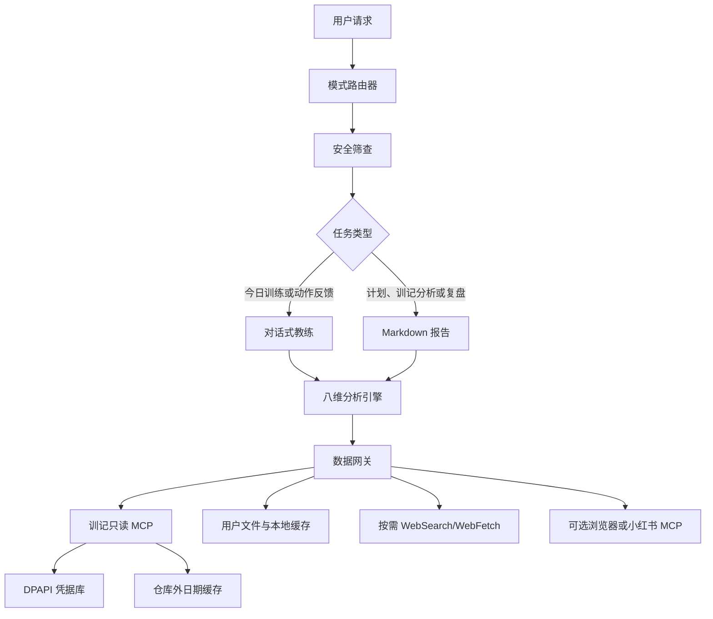

# 健康健身教练 V2：数据连接与双模式输出设计

日期：2026-08-01

状态：已完成方案评审，待用户审阅书面规格

基线：`healthy-fitness-coach` V1，提交 `bcc4491`

## 1. 背景

V1 已覆盖安全筛查、训练计划、现场辅助、营养、恢复、日志与复盘，并完成了创作者观点蒸馏和安全评测。实际试用暴露了三个产品缺口：

1. 所有任务都以连续对话呈现，周期计划和数据复盘缺少可留存的 Markdown 交付物；
2. 计划主要依赖用户口述，不能读取训记等健身软件中的真实训练数据；
3. 分析缺少统一的多维诊断框架，Skill 也没有稳定的联网、登录页面和第三方数据工具路由。

V2 采用“Skill＋本地 MCP Plugin”方案，在不削弱 V1 安全边界的前提下，增加训记只读连接、仓库外缓存、自动输出模式、八维分析和按需联网。

## 2. 目标与非目标

### 2.1 目标

- 根据任务自动选择持续对话或 Markdown 文件；
- 通过官方 `/api_trains_for_llm` 接口读取训记真实训练数据；
- 使用 Windows DPAPI 或等效系统凭据能力保护 API Key；
- 按账号匿名指纹和训练日期缓存结果，避免重复请求；
- 同时保留原始训练文本和标准化数据，容忍接口格式变化；
- 使用八维诊断矩阵生成可追溯、可验证的训练调整建议；
- 按需使用 WebSearch、WebFetch、浏览器或可选小红书 MCP；
- 保持健康优先、自然训练、禁止 PED 和极端减脂等 V1 边界；
- 通过 V1 对比评测证明 V2 在文件交付、数据分析、缓存和安全方面确有改进。

### 2.2 非目标

- 首版不写回或修改训记训练记录；
- 首版不开发小红书爬虫，不绕过登录、验证码或平台访问限制；
- 首版不同时实现 Keep、Hevy、Strava、Garmin、HealthKit 和 Health Connect；
- 不建设长期云端健康数据库或可视化数据中台；
- 不把训练数据用于广告、画像、模型训练或用户未授权的其他用途；
- 不诊断疾病、损伤或根据训练记录替代医疗评估。

## 3. 已确认的产品决策

| 决策 | 结果 |
|---|---|
| 产品形态 | Skill＋本地 MCP Plugin |
| 输出模式 | 自动判断，用户可随时覆盖 |
| 联网策略 | 按需联网，不为每次分析强制搜索 |
| 训记权限 | V2 首版只读 |
| 凭据 | Windows DPAPI 本机加密，Key 不进入模型或仓库 |
| 缓存 | 仓库外、按账号指纹和日期隔离 |
| 分析 | 八维诊断，每次最多调整 1～2 个变量 |
| 小红书 | 可选 MCP/浏览器，失败时退化为链接、截图或文本 |

## 4. 总体架构



### 4.1 边界划分

- **健身 Skill**：安全门、任务路由、分析方法、输出格式和降级规则；不处理密钥。
- **模式路由器**：根据任务意图选择对话或文件，并接受用户显式覆盖。
- **训记 MCP**：鉴权、调用、解压、缓存、解析和结构化返回；不生成训练建议。
- **八维分析引擎**：将标准化数据和用户目标转化为诊断与调整建议。
- **研究路由**：决定何时使用公开网络、浏览器或可选 MCP，并管理证据等级。
- **报告生成器**：将结论、依据、调整项和验证指标写成 Markdown。

这些单元通过明确数据契约连接，任何一个外部工具不可用时，Skill 仍能使用其余信息完成降级任务。

## 5. 输出模式设计

### 5.1 自动判断

| 用户任务 | 默认行为 |
|---|---|
| 今日训练、逐组调整、动作反馈 | 持续对话 |
| 一般疼痛或动作替代 | 持续对话，并优先执行安全规则 |
| 4～8 周计划 | 生成 Markdown |
| 训记周报、月报、趋势分析 | 生成 Markdown |
| 平台期诊断、周期复盘 | 生成 Markdown |
| 简短博主观点或最新研究查询 | 对话摘要 |
| 复杂研究或多来源比较 | 生成 Markdown |

用户可用“直接出报告”“进入跟练”“把刚才内容保存下来”覆盖默认模式。

### 5.2 文件行为

- 默认写入当前工作区的 `fitness-reports/`；
- 文件名不出现姓名、手机号、账号 ID 或 API Key；
- 计划文件使用 `YYYY-MM-DD_训练计划.md`；
- 复盘文件使用 `YYYY-MM-DD_训记周复盘_起始日至结束日.md`；
- 趋势文件使用 `YYYY-MM-DD_训练趋势分析.md`；
- `fitness-reports/` 默认加入 `.gitignore`，避免健康数据被意外提交；
- 文件完成后，聊天仅返回三行核心结论和可点击路径；
- 无文件写入能力时，在对话中输出完整 Markdown，并明确未保存。

### 5.3 报告结构

```markdown
# 健身训练分析报告

## 一、核心结论
## 二、目标与数据范围
## 三、数据质量和结论置信度
## 四、八维分析
## 五、表现趋势与异常
## 六、保留项
## 七、本周期调整项
## 八、下一周期计划
## 九、验证指标与复盘时间
## 十、安全边界与数据说明
```

报告区分用户数据、网络资料和模型推断。调整项最多 1～2 个，每项必须说明数据依据、预期效果与验证方式。

## 6. 训记只读连接

### 6.1 官方接口

- Base URL：`https://trains.xunjiapp.cn`
- Method：`POST`
- Path：`/api_trains_for_llm`
- 鉴权：只使用 `Authorization: Bearer <secret>`；
- Body：`{"datestr":"YYYY-MM-DD"}`；
- 返回：gzip JSON，核心数据位于 `res` 数组；
- 限制：同一训练日 90 秒内只能读取一次。

设计文档、源码、测试、日志和示例中均不得出现真实 Key。

### 6.2 MCP 工具契约

首版提供两个只读工具：

#### `xunji_get_training_day`

- 输入：`date`、`refresh=false`；
- 输出：缓存状态、抓取时间、原始记录、标准化训练记录、解析警告；
- 行为：先读缓存；缓存缺失才请求；显式刷新需通过 90 秒限制；
- 失败：返回稳定错误类型，不回显请求头、Key 或内部堆栈。

#### `xunji_get_training_range`

- 输入：`start_date`、`end_date`、`refresh_today=false`；
- 输出：按日期分组的数据、缺失日期、缓存命中率和解析警告；
- 行为：只请求未缓存日期；同一日期的并发请求合并；
- 限制：设置合理最大日期跨度，超出时要求用户缩小范围。

所有未来写入工具必须另行设计、单独授权和确认，不能复用只读工具隐式写回。

## 7. 凭据与隐私

### 7.1 凭据流

```text
用户在本机授权界面输入 Key
→ DPAPI 以当前 Windows 用户身份加密
→ 密文保存在仓库外
→ MCP 进程调用时临时解密
→ 仅注入 Authorization Header
→ 使用后清理内存引用
```

### 7.2 强制要求

- Key 不进入模型上下文；
- Key 不进入 Skill、环境示例、缓存、报告、Git 或工具结果；
- 不使用 query 或 body 传递 Key，降低代理日志与 URL 泄露风险；
- 日志只记录日期、结果类型、缓存状态和匿名请求 ID；
- 用户可以分别删除凭据和训练缓存；
- 鉴权失败只返回 `missing_credentials` 或 `invalid_credentials`；
- 已经暴露在聊天中的 Key 不写入实现，联调结束后建议用户轮换。

### 7.3 数据最小化

- 仅向模型返回完成当前任务所需的日期和训练记录；
- 默认不把完整原始训练文本写入报告；
- 训练备注中的敏感自由文本保留在本地原始层，只有任务确有需要时才传给模型；
- 数据来源为 Garmin 时默认过滤，不进入外部 AI 分析；
- 数据来源未知且涉及敏感健康指标时，不自动分析并提示来源不确定。

## 8. 缓存与标准化

### 8.1 缓存位置

缓存位于仓库外的当前用户应用数据目录，逻辑结构为：

```text
healthy-fitness-coach/
└── xunji-cache/
    └── <account-fingerprint>/
        └── 2026/
            └── 04/
                └── 2026-04-02.json
```

账号指纹由不可逆摘要生成，不保存账号或 Key 原文。

### 8.2 缓存记录

- `schema_version`
- `training_date`
- `fetched_at`
- `account_fingerprint`
- `source_endpoint`
- `raw_res`
- `normalized_records`
- `parse_warnings`
- `response_checksum`

### 8.3 命中与刷新

- 历史日期默认永久命中缓存；
- 当天数据默认命中缓存，用户明确刷新才重新请求；
- 90 秒内刷新不调用接口，返回剩余等待时间；
- 同一账号与日期使用进程锁或文件锁合并并发请求；
- 采用临时文件加原子替换，避免半写入缓存；
- 网络失败、鉴权失败、限流和格式错误不覆盖已有有效缓存；
- 用户可删除单日、日期范围或全部缓存。

### 8.4 标准数据模型

| 字段 | 含义 |
|---|---|
| `training_date` | 训练日期 |
| `localid` | 训记原始训练 ID |
| `train_start` / `train_end` | 开始与结束时间 |
| `session_name` | 训练名称 |
| `session_note` | 原始备注 |
| `exercise_name` | 动作名称 |
| `sets` | 组序号、重量、次数与单位 |
| `raw_text` | 完整原始文本 |
| `parse_status` | `complete`、`partial` 或 `raw_only` |
| `data_source` | `xunji_user`、`external` 或 `unknown` |
| `warnings` | 缺失、异常或格式变化说明 |

解析器不能依赖简单逗号切分。它优先识别 `id:`、`train_time:`、组、重量、次数等明确标记，不能确认的内容保留在原始文本和警告中。

## 9. 八维分析框架

| 维度 | 观察内容 | 决策边界 |
|---|---|---|
| 数据质量 | 完整率、单位、异常值、解析状态 | 数据不足时降低置信度 |
| 目标匹配 | 主目标、目标肌群、训练优先级 | 判断实际训练是否服务目标 |
| 训练刺激 | 周组数、频率、次数区间、RIR | 区分刺激不足与重复堆量 |
| 表现趋势 | 同动作重量、次数、最好组、估算表现 | 只比较相同或可比条件 |
| 疲劳恢复 | 连续退步、训练密度、备注、疼痛 | 区分单日波动与持续疲劳 |
| 结构均衡 | 推拉、上下肢、动作模式和目标肌群 | 识别长期忽略或过度重复 |
| 身体与营养 | 体重、腰围、蛋白质和摄入趋势 | 无数据时明确标记未知 |
| 可持续性 | 周频率、完成率、时长和跳过项目 | 先修复执行，再增加复杂度 |

### 9.1 方法规则

- 训练容量只在相同动作、相近幅度和技术条件下比较；
- 不把不同器械和动作变式的重量直接相加或比较；
- 不把“组数×重量×次数”直接等同于刺激质量；
- 缺少 RIR、动作幅度或技术信息时降低结论置信度；
- 估算力量仅作为趋势，不当作真实 1RM；
- 单次训练只能做执行复盘，不能判定平台期；
- 每次优先调整 1～2 个变量，并设置下一周期验证指标。

### 9.2 时间窗口

- 1 次训练：当日执行分析；
- 2～3 周：初步趋势，只给低风险建议；
- 4 周以上：比较训练量、频率和表现趋势；
- 8 周以上：评估疑似平台、周期结构和长期偏科；
- 数据不足：明确写“暂不能判断”。

### 9.3 决策顺序

```text
检查数据可信度
→ 检查计划执行率
→ 区分正常波动、刺激不足和恢复不足
→ 检查目标肌群与动作结构
→ 调整最多 1～2 个变量
→ 定义下周期验证指标
```

## 10. 联网与外部内容工具

### 10.1 触发条件

联网只用于：

- 最新研究、指南、产品接口和规则；
- 用户询问博主观点；
- 用户提供网页链接；
- 本地证据不足以支持关键结论。

个人训练数据分析优先使用本地记录。外部观点不能覆盖真实数据和安全边界。

### 10.2 工具顺序

```text
训记缓存
→ 训记只读 MCP
→ 用户文件、截图和链接
→ WebFetch 已知公开页面
→ WebSearch 发现最新资料
→ 浏览器或小红书 MCP
→ 请求用户提供截图、导出或文本
```

### 10.3 小红书与登录页面

- 有小红书 MCP 时优先结构化搜索；
- 无 MCP、但用户已登录并授权时使用浏览器工具；
- 公开页面可访问时使用 WebFetch；
- 均不可用时请求链接、截图或文本；
- 不绕过登录、验证码、访问限制和反爬措施；
- 博主内容标记为教练经验或内容观点；
- 涉及伤病、安全或营养剂量时，与指南或同行评议证据交叉核对。

## 11. 错误处理与降级

| 场景 | 用户可理解的结果 |
|---|---|
| MCP 未安装 | 提供安装/授权指引，允许使用导出文件 |
| 凭据缺失或失效 | 要求本机重新授权，不显示 Key |
| 90 秒限流 | 使用缓存并显示可刷新时间 |
| 网络失败 | 使用有效旧缓存并标注数据时间 |
| 返回格式变化 | 保留原文，标记部分解析，不强行计算 |
| WebSearch 不可用 | 使用本地知识并标注证据日期边界 |
| 登录页面不可访问 | 请求链接、截图或导出 |
| 无文件写入能力 | 输出完整 Markdown 正文并明确未保存 |

安全红旗始终优先于数据分析和工具调用。发生胸痛、异常气短、晕厥、急性严重外伤等情况时，沿用 V1 的停止训练与专业评估规则。

## 12. Plugin 组成与依赖

```text
healthy-fitness-coach-plugin/
├── plugin manifest
├── skills/
│   └── healthy-fitness-coach/
│       ├── SKILL.md
│       ├── references/
│       ├── assets/
│       └── evals/
└── xunji MCP
    ├── credential service
    ├── API client
    ├── cache service
    ├── parser/normalizer
    └── read-only tools
```

`agents/openai.yaml` 声明训记 MCP 为核心依赖，并将浏览器、小红书 MCP 等标记为可选能力。WebSearch/WebFetch 由宿主提供时使用；缺失时按降级流程继续。

## 13. 验收与评测设计

V2 使用 V1 快照作为基线，建立 `iteration-2` 成对评测。至少覆盖：

1. 周期计划默认生成真实 Markdown 文件；
2. 今日训练保持对话模式；
3. 用户显式覆盖自动模式；
4. 训记单日首次请求后写入缓存；
5. 相同日期第二次读取不调用网络；
6. 90 秒内显式刷新被本地拦截；
7. 日期范围只请求缺失日期；
8. gzip JSON 和 `res` 数组解析；
9. `id:` 与 `train_time:` 原样保留；
10. 格式异常时保留原文并降低置信度；
11. 报告按八维分析且最多调整两个变量；
12. 单次训练不被误判为平台期；
13. WebSearch 只在需要最新信息时触发；
14. 登录页面不可访问时正确降级；
15. 凭据、请求头、缓存、报告和日志中不存在 API Key；
16. Garmin 来源数据不会进入模型分析；
17. V1 六类安全案例继续全部通过。

评测产物继续使用 `eval_metadata.json`、逐条断言重算、`benchmark.json` 和静态 `review.html`，并与 V1 输出并排展示。

## 14. 实施拆分

为控制风险，实施分为四个可独立验证的阶段：

1. **Skill V2 行为层**：模式路由、Markdown 模板、八维分析和联网降级；
2. **训记本地连接层**：DPAPI、只读 API、缓存、标准化和工具契约；
3. **Plugin 打包层**：manifest、依赖声明、安装与授权流程；
4. **评测与交付层**：V1/V2 成对测试、安全回归、静态审阅页和最终包。

只有前一阶段通过测试后才进入下一阶段。真实 Key 不写入任何实现或测试夹具，接口测试使用本机凭据或脱敏模拟响应。

## 15. 成功标准

- 用户无需反复提醒即可获得正确的对话或 Markdown 输出；
- 训记同一日期的重复分析不产生重复 API 请求；
- 真实 Key 不出现在模型输入、仓库、日志、缓存、报告和评测产物中；
- 训记文本格式变化不会造成原始数据丢失；
- 报告能清晰区分事实、推断、不确定性和外部观点；
- 调整建议由八维数据支持，并保持最小变更原则；
- 外部工具不可用时仍能给出明确、可执行的降级路径；
- V1 安全能力无回归，V2 新增功能通过独立审阅。
